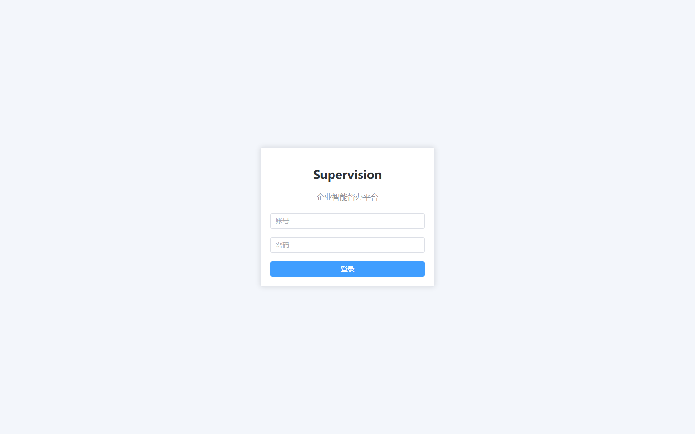
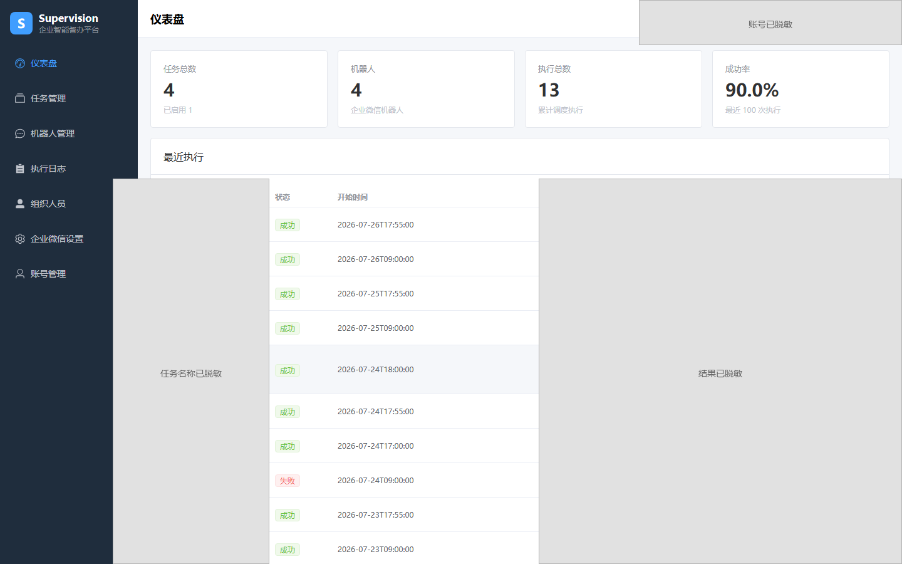
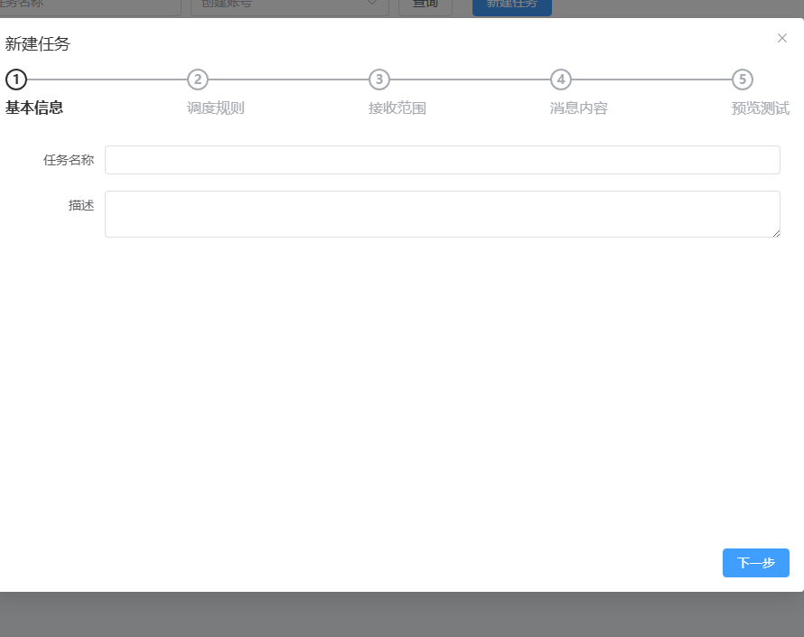
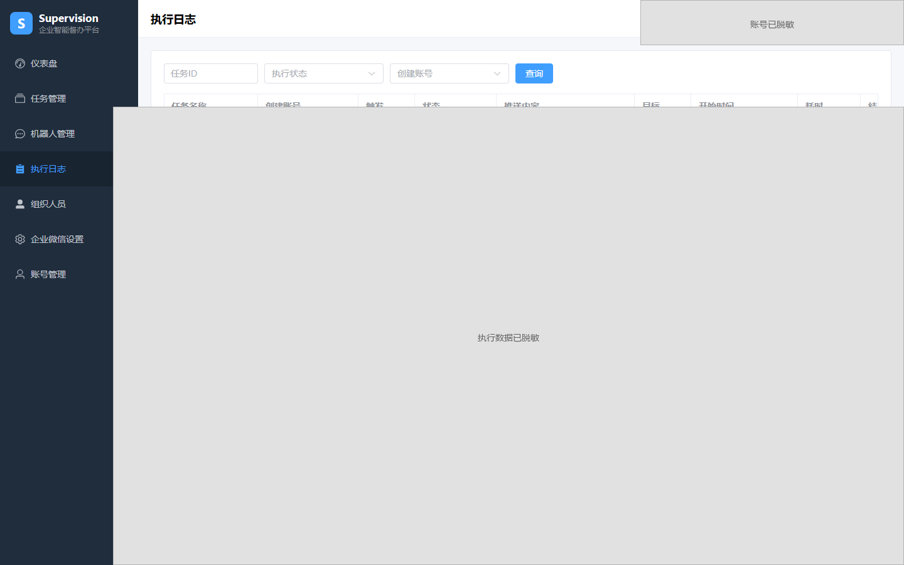

# Supervision

> Enterprise intelligent supervision platform for WeCom (WeChat Work).
> 中文文档：[README.md](README.md)

[](https://github.com/zhangk-miduo/Supervision/actions/workflows/ci-cd.yml)
[](LICENSE)
[](https://github.com/zhangk-miduo/Supervision/commits/main)

Supervision turns management tasks that rely on human memory and manual follow-up into configurable, schedulable, and traceable automated supervision tasks.

The current release focuses on the WeCom (WeChat Work) scenario, providing task orchestration, scheduled dispatch, message delivery, organization sync, account permissions, and execution auditing — delivered as a complete runtime via Docker Compose.

## Why Supervision

Many teams use WeCom group-bot webhooks for reminders, but soon hit these pain points:

- Reminders depend on human memory or scattered cron scripts — easy to miss, duplicate, and impossible to trace.
- Webhook URLs are scattered across docs; hard to hand over when someone leaves.
- Nothing is logged — when something goes wrong, you don't know who / when / whom.
- Each department writes its own script; no unified permission or audit control.

Supervision consolidates these "manual + script" duties into one configurable, schedulable, auditable platform.

| Dimension | Manual / group-bot scripts | Supervision |
| --- | --- | --- |
| Scheduling | edit code or remember a calendar | wizard-based: Cron / workdays / multiple cycles |
| Delivery log | none | full delivery records + preview + test send |
| Account permission | none | ADMIN / user roles + data isolation |
| Audit | none | execution logs + sensitive-data masking |
| Maintainability | scattered scripts | unified platform + Docker Compose delivery |

## Capabilities

### Supervision tasks

- Five-step wizard: basic info, schedule rules, target scope, message content, send test.
- Manual, once, daily, national workdays, weekly, monthly, fixed interval, and Cron schedules.
- Preview future execution times, run now, failure retry, overlap strategy, misfire strategy.
- Text, Markdown, Markdown v2, image, news, file, voice, and template-card messages.
- One task can target multiple groups, with a warning on possible duplicate delivery.

### WeCom integration

- Manage group-bot webhooks with connectivity test, enable/disable, and public sharing.
- Two delivery channels: group-bot messages and WeCom application messages.
- Configure WeCom app credentials, validate connection, sync departments and members.
- Query org members by department, name, status, gender, and sync status.
- Persist message delivery records with preview and test send.

### Account, permission, and audit

- Password login + Bearer token sessions; forced password change on first use of a temp password.
- ADMIN and regular user roles; account management and WeCom config are admin-only.
- Tasks, execution records, and private bots isolated by creator; public bots selectable by others but editable only by creator.
- Before deleting/disabling/revoking a shared bot, checks impact on other accounts' enabled tasks.
- Sensitive config (e.g. webhooks) encrypted at rest; sensitive info masked in logs.

### Runtime and observability

- Dashboard with task and execution overview.
- Execution logs with pagination, status filter, and detail view.
- MySQL for business data, Redis for sessions/state, RabbitMQ for async notifications, Quartz for scheduling.
- Flyway for schema evolution; Spring Boot Actuator and `/api/health` for health checks.

## Architecture

```text
Browser
  │
  ▼
Nginx / Vue 3 admin
  │  /api
  ▼
Spring Boot API
  ├─ Auth, account & data permission
  ├─ Task, scheduling & execution engine
  ├─ WeCom org & message service
  └─ Execution records & delivery audit
       │
       ├─ MySQL 8
       ├─ Redis 7
       ├─ RabbitMQ 3.13
       └─ WeCom API / group-bot webhook
```

## Tech stack

| Layer | Tech |
| --- | --- |
| Backend | Java 17, Spring Boot 3.2.2, MyBatis-Plus 3.5.5, Quartz, Flyway |
| Frontend | Vue 3, TypeScript, Vite 5, Element Plus, Pinia, Axios |
| Infra | MySQL 8.0, Redis 7, RabbitMQ 3.13, Nginx |
| Delivery | Docker, Docker Compose |

## Quick start

### 1. Prerequisites

- Docker Engine
- Docker Compose v2
- ~2 GB free RAM recommended

No need to install Java, Maven, Node.js, MySQL, Redis, or RabbitMQ locally.

### 2. Configure environment

```bash
cp .env.example .env
```

Edit `.env` and replace every placeholder. At least:

| Variable | Purpose |
| --- | --- |
| `MYSQL_ROOT_PASSWORD` | MySQL root password |
| `DB_USERNAME` / `DB_PASSWORD` | App DB account and password |
| `RABBITMQ_USERNAME` / `RABBITMQ_PASSWORD` | RabbitMQ account and password |
| `SUPERVISION_CRYPTO_KEY` | Encryption key for sensitive config; generate with `openssl rand -base64 32` |
| `SUPERVISION_ADMIN_USERNAME` | Initial admin username |
| `SUPERVISION_ADMIN_PASSWORD` | Initial admin password |

`.env` contains secrets — never commit it.

### 3. Build & start

```bash
docker compose up -d --build
```

After startup:

- Web: <http://localhost:8002>
- Health: <http://localhost:8002/api/health>

First login uses the initial admin account from `.env`; temp-password accounts are forced to change password.

### 4. Check status

```bash
docker compose ps
docker compose logs -f api
curl -f http://localhost:8002/api/health
```

## First-use checklist

1. Log in with initial admin, change password.
2. In "WeCom Settings", fill Corp ID, App AgentId, Secret; validate.
3. Sync WeCom org; confirm departments/members.
4. In "Bot Management", add a group-bot webhook; run a config test.
5. Create a supervision task: schedule, scope, content.
6. Preview + test send before enabling.
7. Confirm results in "Execution Logs".

WeCom config guide: [doc/guide.supervision.wecom-configuration.md](doc/guide.supervision.wecom-configuration.md).

## Local development

Frontend:

```bash
cd build/web
npm install
npm run dev      # dev server
npm run build    # production build -> dist/
```

Backend (requires Java 17; built via Docker):

```bash
docker compose build api
```

`build/backend/Dockerfile` runs `mvn clean package` with backend tests during image build.

Smoke test after full startup: health check → login → create a manual task → run now → find the record in execution logs.

## Screenshots

| Login | Dashboard |
| --- | --- |
|  |  |

| Create Task Wizard | Execution Logs |
| --- | --- |
|  |  |

> Sensitive information such as task names, accounts, message content, and execution results has been redacted.

## Known limitations

- Single backend instance + single Quartz; no multi-instance HA scheduling yet.
- Primary delivery channel is WeCom; DingTalk, Feishu, email, and AI nodes are not implemented yet.
- Group bots cannot guarantee selected members exist in the target group, so @ mentions are limited by group membership.
- Workday scheduling depends on the built-in or imported work calendar coverage; verify the target year before production use.
- Compose maps only the web service to host port 8002 by default; DB, Redis, RabbitMQ, and the backend API are not exposed.

More in [DEPLOYMENT.md](DEPLOYMENT.md) and [deployment-migration guide](doc/guide.supervision.deployment-migration.md).

## Roadmap

- [ ] Multi-instance HA scheduling (remove single Quartz point)
- [ ] More delivery channels: DingTalk, Feishu, email
- [ ] AI nodes (smart duty content & summaries)
- [ ] Richer work-calendar / holiday data sources
- [ ] Open API & webhook events for third-party integration

## Contributing

See [CONTRIBUTING.md](CONTRIBUTING.md). Dev setup and verification: [AGENTS.md](AGENTS.md).

## Security

Report vulnerabilities per [SECURITY.md](SECURITY.md). Do not disclose in public issues.

## License

[Apache License 2.0](LICENSE).
